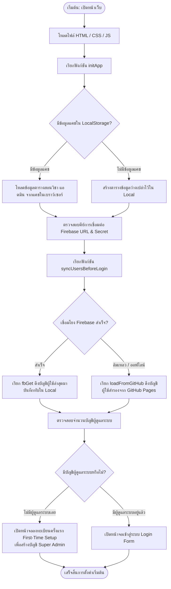
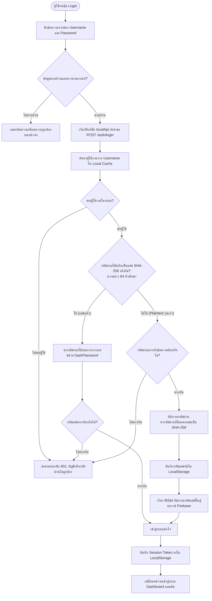
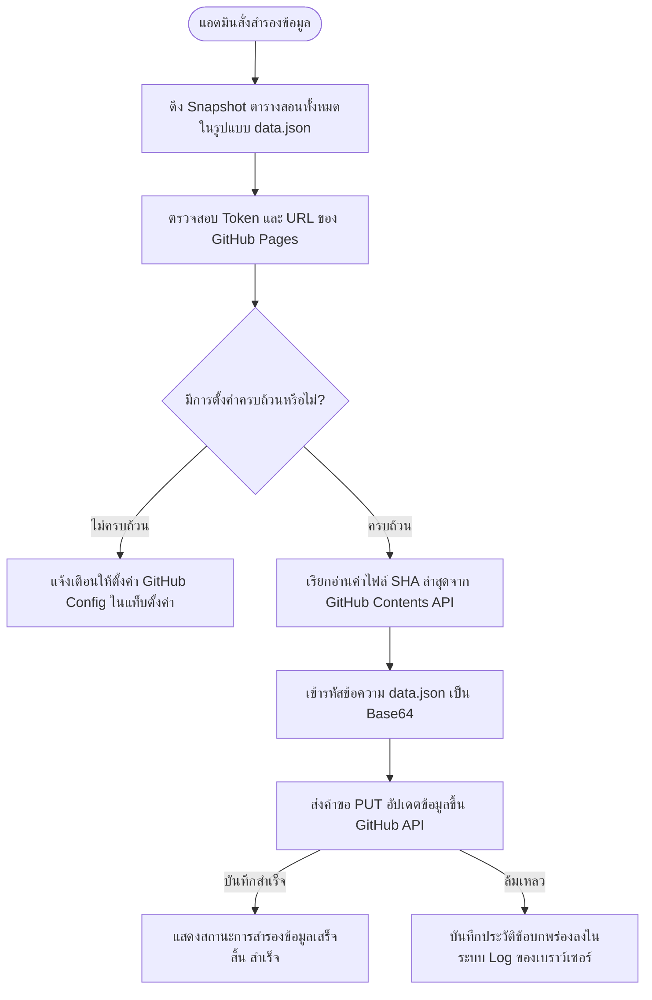

# แผนผังการทำงานของระบบตารางสอนประจำสัปดาห์ (Weekly Timetable Flowcharts)

เอกสารฉบับนี้รวบรวมแผนผังการทำงาน (Flowcharts) ของระบบจัดการตารางสอนประจำสัปดาห์แบบเรียลไทม์ โดยใช้ภาษา **Mermaid** ในการอธิบายโฟลว์การทำงานในแต่ละส่วนของโปรแกรมอย่างละเอียด

---

## 1. แผนผังการเริ่มต้นระบบและโหลดข้อมูลแคช (App Initialization Flow)
แผนผังอธิบายขั้นตอนเมื่อผู้ใช้งานเปิดหน้าเว็บในเบราว์เซอร์ การดึงข้อมูลแคชในบราวเซอร์ และการเชื่อมโยงข้อมูลผู้ใช้จาก Google Firebase หรือ GitHub



---

## 2. แผนผังการล็อกอินและการตรวจสอบความปลอดภัยรหัสผ่าน (Authentication & Password Auto-Upgrade Flow)
แผนผังอธิบายขั้นตอนการตรวจสอบความถูกต้องของสิทธิ์ผู้ใช้งาน และระบบการตรวจสอบการเข้ารหัสผ่านเดิมแบบ Plaintext เพื่อทำการอัปเกรดเป็นความปลอดภัยระดับ SHA-256 โดยอัตโนมัติ



---

## 3. แผนผังระบบซิงโครไนซ์ข้อมูลเรียลไทม์ (Real-Time Database Sync Flow)
แผนผังแสดงการไหลของข้อมูลเมื่อแอดมินแก้ไขตารางสอน ระบบจะส่งข้อมูลแบบเข้ารหัส Token ไปยังคลาวด์ Firebase และกระจายข้อมูลแบบเรียลไทม์ด้วย Server-Sent Events (SSE) ไปยังเครื่องผู้ใช้งานอื่นๆ ทันที

```mermaid
graph TD
    subgraph เครื่องแอดมินผู้เขียน (Admin Client)
        A1([แอดมินแก้ไขตารางสอน]) --> A2[เรียกฟังก์ชัน api PUT /entries/id]
        A2 --> A3[อัปเดตตาราง LocalStorage ทันที]
        A3 --> A4[เรียก fbSet ส่งคำขอข้อมูลไปยัง Firebase]
    end

    subgraph เซิร์ฟเวอร์ฐานข้อมูลคลาวด์ (Google Firebase)
        A4 -->|ส่งข้อมูลผ่าน REST API + Token| F1{ตรวจสอบ Token ความปลอดภัย ?auth=SECRET}
        F1 -- "ไม่ถูกต้อง" --> F2[ปฏิเสธคำขอ 403 Forbidden]
        F1 -- "ถูกต้อง" --> F3[บันทึกข้อมูลทับบนคลาวด์ Node /data/entries/id]
        F3 -->|กระจายการเปลี่ยนแปลงผ่าน SSE Stream| F4[ยิงเหตุการณ์ 'put' ไปยังเบราว์เซอร์ทั้งหมด]
    end

    subgraph เครื่องผู้ใช้อื่นๆ (Other Clients/Public Viewer)
        F4 -->|SSE Stream event| B1{ได้ยินเหตุการณ์การเปลี่ยนแปลง}
        B1 -->|ข้อมูลการแก้ไขตาราง| B2[นำข้อมูลใหม่ไปเขียนทับแคช Local ในเบราว์เซอร์]
        B2 --> B3[เรียกฟังก์ชัน renderScheduleView อีกครั้ง]
        B3 --> B4([ตารางเรียนบนหน้าจอปรับปรุงให้สอดคล้องกันทันที])
    end
```

---

## 4. แผนผังระบบสำรองข้อมูลและดึงข้อมูลกู้คืนอัตโนมัติ (GitHub Backup & Fallback Flow)
แผนผังแสดงกระบวนการสำรองข้อมูลโครงสร้างตารางเรียนขึ้นสู่คลาวด์สำรองบน GitHub และระบบเรียกคืนข้อมูลโดยอัตโนมัติเมื่อระบบฐานข้อมูลหลักขัดข้อง


